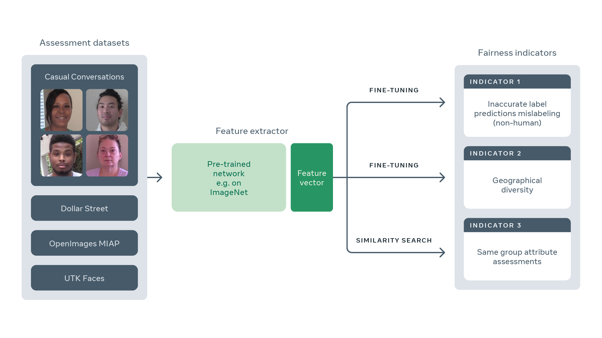

# Fairness Indicators for Systematic Assessments of Visual Feature Extractors
[[arxiv]()] , [[blogpost]()]



Systematic diagnosis of fairness, harms, and biases of computer vision systems is an important step towards building socially responsible systems. To initiate an effort towards standardized fairness audits, we propose _three fairness indicators_, which aim at _quantifying_ harms and biases of visual systems. Our indicators use existing publicly available datasets collected for fairness evaluations, and focus on three main types of harms and bias identified in the literature, namely _harmful label associations, disparity in learned representations of social and demographic traits_, and _biased performance on geographically diverse images from across the world_. We define precise experimental protocols applicable to a wide range of computer vision models. These indicators are part of an ever-evolving suite of fairness probes and are not intended to be a substitute for a thorough analysis of the broader impact of the new computer vision technologies. Yet, we believe it is a necessary first step towards (1) facilitating the widespread adoption and mandate of the fairness assessments in computer vision research, and (2) tracking progress towards building socially responsible models.

To study the practical effectiveness and broad applicability of our proposed indicators to any visual system, we apply them to “off-the-shelf” models built using widely adopted model training paradigms which vary in their ability to whether they can predict labels on a given image or only produce the embeddings. We also systematically study the effect of data domain and model size. The results of our fairness indicators on these systems suggest that blatant disparities still exist, which highlight the importance on the relationship between the context of the task and contents of a datasets. The code will be released to encourage the use of indicators.

This repo contains the code and configs for these indicators. We share the step-by-step details on how to use VISSL for the fairness indicators proposed in the research.

- [Indicator1: Harmful Label association](https://github.com/facebookresearch/vissl/tree/main/projects/fairness_indicators/label_associations_indicator1.md)
- [Indicator2: Geographical Diversity](https://github.com/facebookresearch/vissl/tree/main/projects/fairness_indicators/geographical_diversity_indicator2.md)
- [Indicator3: Similarity based attribute retrieval](https://github.com/facebookresearch/vissl/tree/main/projects/fairness_indicators/same_attribute_retrieval_indicator3.md)

## Citation

If you use this research in your work, please use the citation:

```BibTeX
@article{goyal2022fairness,
      title={Fairness Indicators for Systematic Assessments of Visual Feature Extractors},
      author={Priya Goyal and Adriana Romero Soriano and Caner Hazirbas and Levent Sagun and Nicolas Usunier},
      year={2022},
      eprint={2202.07603},
      archivePrefix={arXiv},
      primaryClass={cs.CV}
}
```
